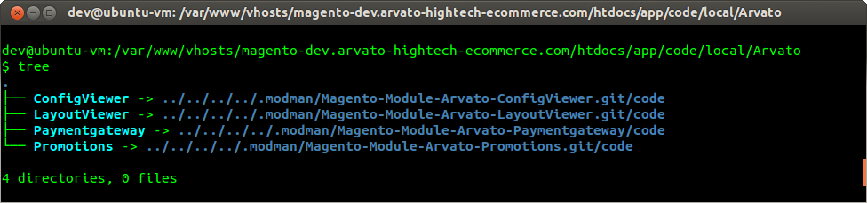
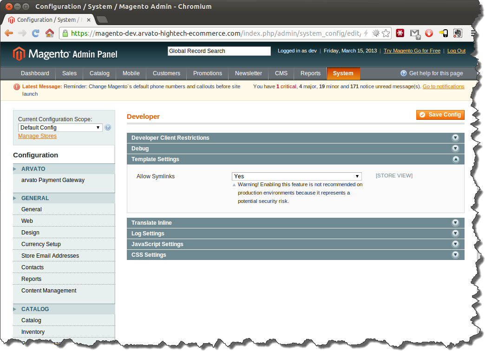
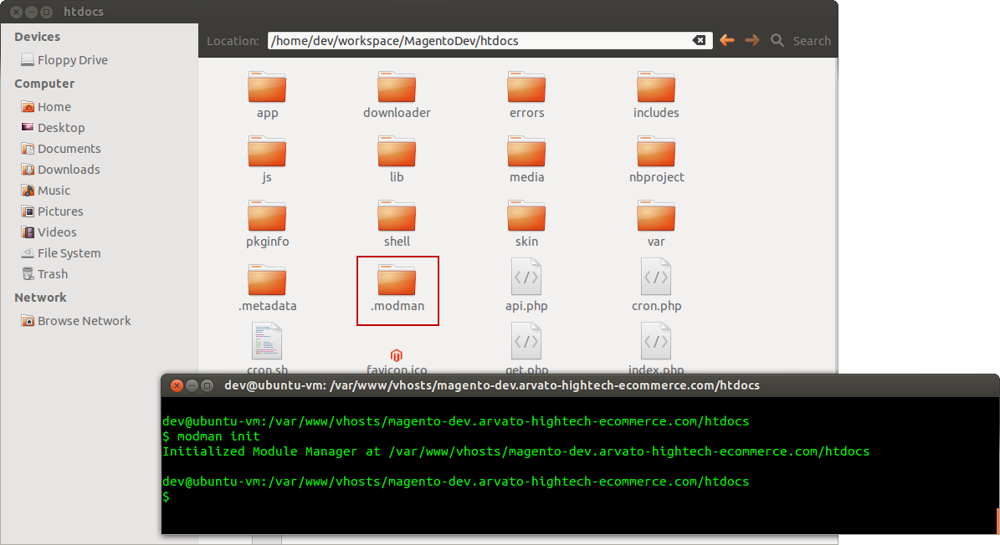
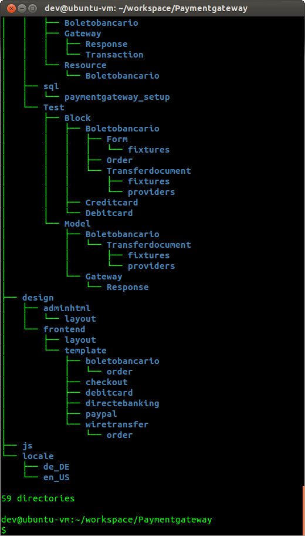
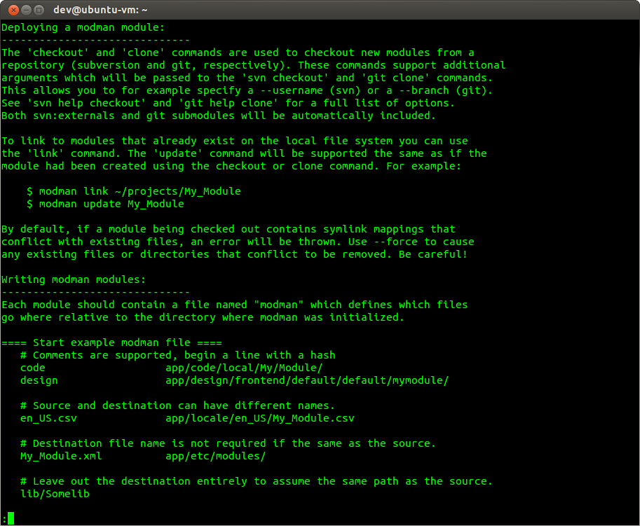
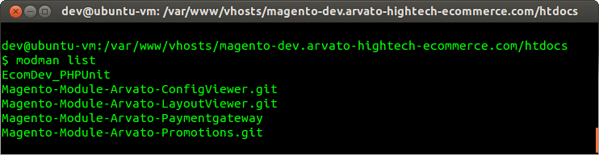
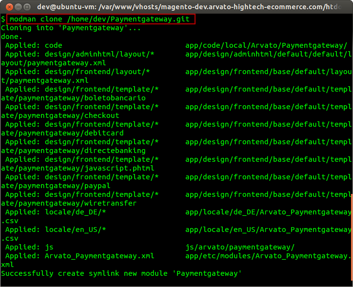
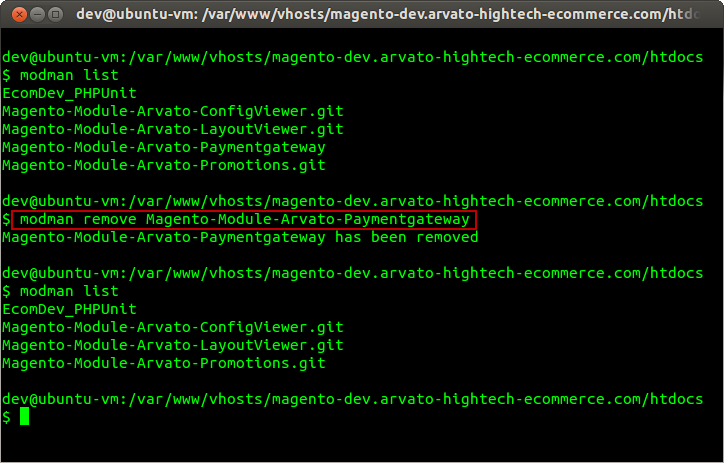
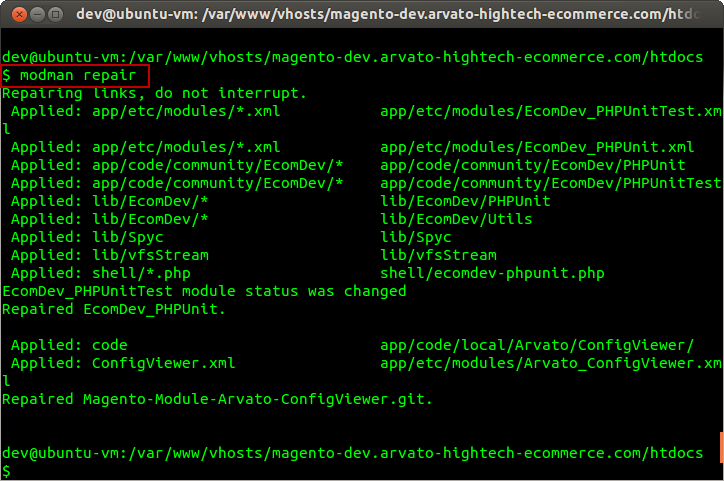

# Deploying Magento Modules with modman

A short introduction into modman and how you can use it to develop and deploy Magento modules (on linux based operating systems).

## What is modman?

modman is a bash script (for linux) which allows you to develop magento modules in a single folder which can be installed into any Magento installation.

https://github.com/colinmollenhour/modman

## What modman can do for you

- Keep track of all modules that have been installed
- Install modules
- Update installed modules
- Remove installed modules

## Installing modman (on Ubuntu)

To install modman you only need to download the modman bash script, make it executable and add it to your PATH.

### Open a terminal/bash and enter this line

This line will download modman-installer and install modman:

<!-- language: lang-bash -->

    bash < <(wget -O - https://raw.github.com/colinmollenhour/modman/master/modman-installer)

### Enabling Symlinks in Magento

modman uses filesytem links to deploy modules into Magento.
By default the support for symlinks is disbaled in Magento
because this feature has an performance impact and is a potential security risk. Which is not wanted on production systems. But for development this is not a problem.

Therefor you must configure Magento make use of symlinks.

Open Magento's admin panel and goto `Magento Admin Panel > System > Configuration > Advanced > Developer > Template Settings` and set "Allow Symlinks" to "Yes".

**Note**: When you install Magento modules on production we will not use symlinks for the deployment.

### Make your Magento installation ready for modman

In order to use modman in your Magento installation you need to **initialize** the modman deployment root (".modman"):

<!-- language: lang-bash -->

    cd <magento-folder>
    modman init

This will create a ".modman" folder which will be the place where all modules are "cloned" into.

Once you have initialized your modman "deploy root" you can start installing modules with modman.

## modman project structure

The main advantage of modman is that it lets you keep all files needed for a Magento module in a single folder, even though they will be placed into many different folders during the "deployment".

All that is needed for a modman project is a file called "modman" which defines which files/folders must be copied where.

**Syntax of the "modman" deplyoment file**

`<source-folder-or-file> <spaces or tabs> <target-folder>`

**Example: modman file of the arvato Paymentgateway module**

    code                            app/code/local/Arvato/Paymentgateway/
    design/adminhtml/layout/*       app/design/adminhtml/default/default/layout/
    design/frontend/layout/*        app/design/frontend/base/default/layout/
    design/frontend/template/*      app/design/frontend/base/default/template/paymentgateway/
    locale/*                        app/locale/en_US/
    js                              js/arvato/paymentgateway/
    Arvato_Paymentgateway.xml       app/etc/modules/Arvato_Paymentgateway.xml

## Common modman tasks

### Getting help

If you want to print help information about modman, you can add the `--help` or `--tutorial` command line arguments to it or simply execute modman without any arguments:

<!-- language: lang-bash -->

    modman --help

In order to display the modman **online tutorial** you must add the `--tutorial` command line argument:

<!-- language: lang-bash -->

    modman --tutorial

### Print out a list of all installed modules

The **list** command prints a list of all installed modules.

<!-- language: lang-bash -->

    cd <magento-folder>
    modman list

### Installing a module

**modman clone <Path-to-Git-Repository>** installs a modman module (which is controlled by git version control).

<!-- language: lang-bash -->

    cd <magento-folder>
    modman clone <Path-to-Git-Repository>

If you want to install a module which is controlled by another SCM you can use the `checkout`, `hgclone` or `link` command instead.

## Updating modules

If you want to update one or more modules which are already installed you can use the `update-all` or `update <module-name` commands:

<!-- language: lang-bash -->

    cd <magento-folder>
    modman update-all

### Removing an installed module

**modman remove <modulename>** removes an module.

<!-- language: lang-bash -->

    cd <magento-folder>
    modman remove <modulename>

### Repairing file-system links

Sometimes, when new top-level folders have been added a modman module a simple `update-all` won't suffice because the filesystem links to the new folders do not exist yet.

In this case you can rebuild all filesystem links with `modman repair`:

<!-- language: lang-bash -->

    cd <magento-folder>
    modman repair

## Links

- [modman](https://github.com/colinmollenhour/modman)
- [modman wiki](https://github.com/colinmollenhour/modman/wiki)
- [modman tutorial](https://github.com/colinmollenhour/modman/wiki/Tutorial)

---

language: en
date: 2013-03-15
tags: Magento, modman, Deployment