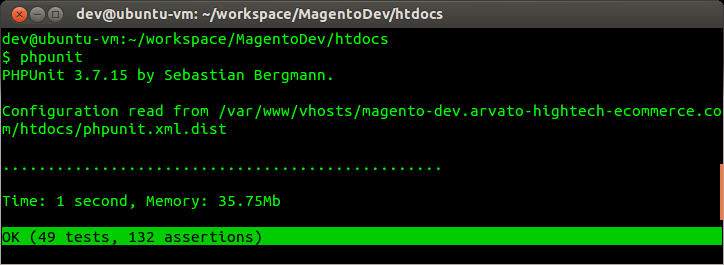

# PHP Unit Installation

Installing PHP Unit on Ubuntu

PHPUnit

<!-- language: lang-sh -->

	sudo su
	pear config-set auto_discover 1

	pear install pear.phpunit.de/PHPUnit

Submodules

<!-- language: lang-sh -->

	sudo su
	pear config-set preferred_state beta

	pear install phpunit/DbUnit
	pear install phpunit/PHPUnit_Selenium
	pear install phpunit/PHPUnit_Story
	pear install phpunit/PHPUnit_TestListener_DBUS
	pear install phpunit/PHPUnit_TestListener_XHProf
	pear install phpunit/PHPUnit_TicketListener_Fogbugz
	pear install phpunit/PHPUnit_TicketListener_GitHub
	pear install phpunit/PHPUnit_TicketListener_GitHub
	pear install phpunit/PHPUnit_TicketListener_GoogleCode
	pear install phpunit/PHPUnit_TicketListener_Trac
	pear install phpunit/PHP_Invoker

**General Links**

- [PHPUnit Manual - Installing PHPUnit](http://www.phpunit.de/manual/3.6/en/installation.html)
- [github: PHPUnit](https://github.com/sebastianbergmann/phpunit/)

**Troubleshooting Links**

- http://www.ducea.com/2008/02/01/installing-pear-beta-packages/
- http://develcuy.com/en/howto-install-xhprof-ubuntu-howto-use-drupal-6x-7x
- http://web-dev-wiki.blogspot.de/2012/11/how-to-install-dbus-for-php-on-ubuntu.html

---

date: 2013-03-05
langauge: en
tags: PHP, Unit Testing