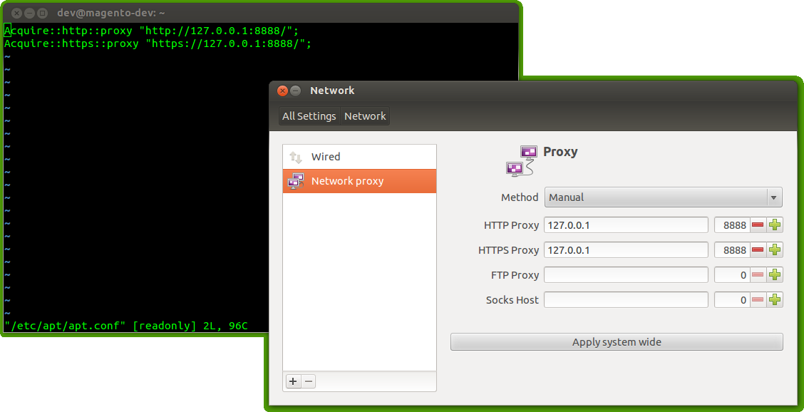
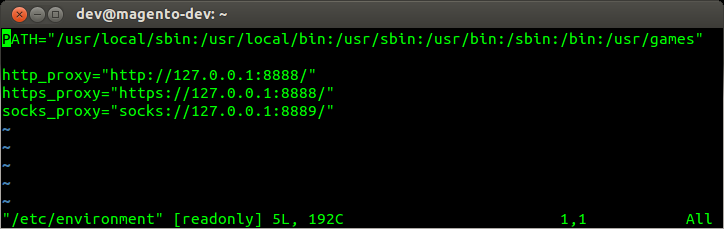
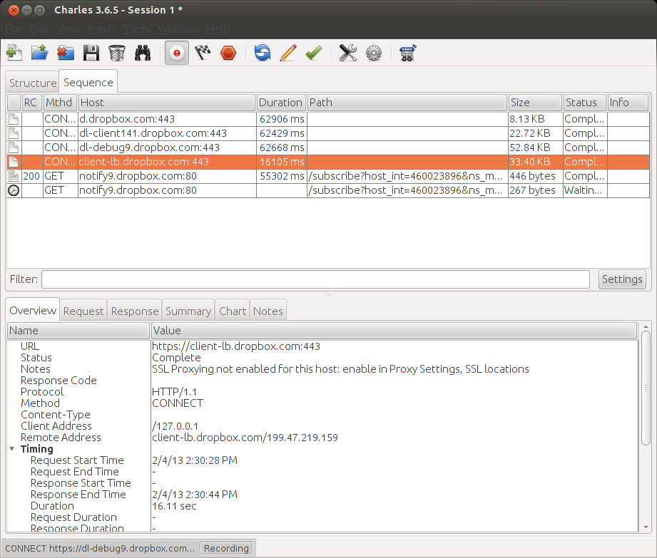

# Enable system-wide proxy on Ubuntu

Configure a system-wide http, https, ftp und SOCKS proxy for Ubuntu.

A system wide proxy can be set in the the file "/etc/apt/apt.conf" or via the Network Settings dialog ("gnome-control-center network"):

Additionally you should set the proxy environment-varibales in "/etc/environment":

If everything works you should be able to debug (hopefully all) your HTTP and HTTPs traffic with tools such as "Charles - Web Debugging Proxy Application":

**Related Links**

- [askubuntu.com: Proxy configuration change](http://askubuntu.com/questions/134867/proxy-configuration-change/134902#134902)
- [askubuntu.com: How do I set systemwide proxy servers in Xubuntu, Lubuntu or Ubuntu Studio?](http://askubuntu.com/questions/150210/how-do-i-set-systemwide-proxy-servers-in-xubuntu-lubuntu-or-ubuntu-studio)
- [askubuntu.com: Where are the proxy settings saved?](http://askubuntu.com/questions/171975/where-are-the-proxy-settings-saved)
- [Charles Web Debugging Proxy](http://www.charlesproxy.com)
- [arch linux: Proxy settings](https://wiki.archlinux.org/index.php/Proxy_settings)

---

date: 2013-02-04
language: en
tags: Ubuntu, Proxy