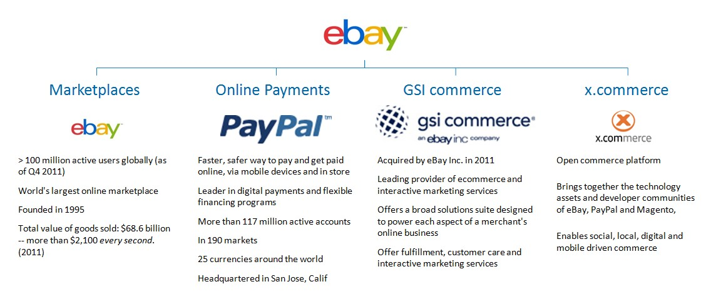
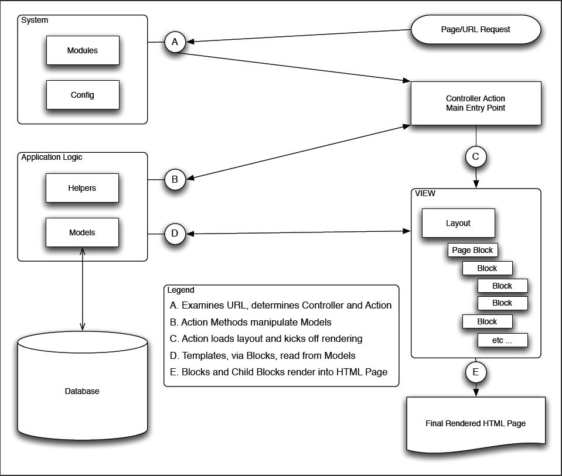
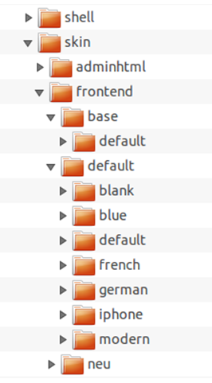
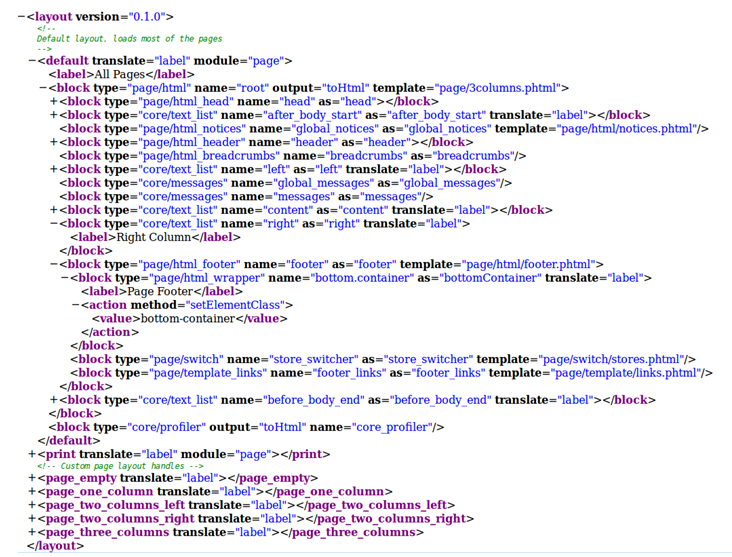

# Magento Developer Tutorial

## Overview

* Quick Demo (Admin)

----------
###  Who is Magento - A Company-Overview ##
 * 100%-owned by ebay since 2010
 * Subbrand listed under x.commerce
 * Headquarter in Los Angeles (USA)
 * Local subsidiaries in Berlin, London, Brussels and Dublin
 * Employee-count: ca. 400
 * > 150.000 installations world-wide
 
### Relating Magento to ebay:

----------
## How are they doing development?

 * 2 Edition available - Community Edition (CE) and Enterprise Edition (EE)
 * Both Editions are developed by the Magento Company itself, whereas the CE is always a few versions behind the EE
 * Apart from the version difference, EE contains more default extensions than CE

### Enterprise Only Features

* SolR Search (but extensions for CE available)
* Customer Segmentation with Targeted Offerings
* Dynamic - Rules-bades product relationships
* Automatic E-Mail Reminders
* Private Sales for custer groups (incl. Invitation)
* Gift Registry
* Gift Wrap Option
* Rebate Points Modul
* Several Wishlists per Customer
* Enhanced Catalog and Content Management System (CMS+)
* Staging, Merging and Rollback of Content
* Scheduled Publishing of Pages
* Customer-specific Profile Attributes
* Improved Performance (but you can achieve this with Varinish for CE)
* Payment Bridge
* Data Encrpytion and Key Management
* Call Center with Assisted Shopping
* Minimum Advertised Price
* Full-page Caching
* Customer Segmentation with Targeted Offerings
* Recurring Payments
* Full Page Caching

### Magento Connect  
Url: [http://www.magentocommerce.com/magento-connect/](http://www.magentocommerce.com/magento-connect/ "http://www.magentocommerce.com/magento-connect/")

## General Magento Concepts

* Magento is based on OOP and the Zend-Framework
* Module-based Architecture
* Event-Driven Architecture
* Configuration-Based

### MVC
 * Configuration-based Routing
 * Configuration-based Views (Layout+Blocks)
 * Thin-Controllers
 * Models contain Business Logic   
   
   

### The Filesystem

**Top-Level** 
/ app - This is where the big stuff happens :) 
/ skin / {area} / {package} / {theme} / - is where design package css and images are 
/ lib - are libraries such as Zend and Varien 
/ js - where you put your javascripts 
/ media - uploaded files (product images, pdf documents, etc) 
/ tests - Unit tests (not done yet) 
/ var - temporary files 
/ includes - contains config.php 

**Inside the app folder** 
/ app / etc - global configuration. register your module with the system here 
/ app / code - is where modules have installed their models and controllers 
/ app / design - is location of design packages (layouts, templates, translations) 
/ app / locale - locale files 
 
**App code pools** 
/ app / code / core - are core team developed or certified modules 
/ app / code / community - are community contributed modules 
/ app / code / local - are local customizations 
 
**App design-reated** 
/ app / design / frontend - frontend design 
/ app / design / adminhtml - HTML admin panel design 
/ app / design / {area} / {package} / {theme} - theme customizations 
/ app / design / {area} / {package} / {theme} / layout - .xml files that define block structure for different cases in website flow 
/ app / design / {area} / {package} / {theme} / template - .phtml (html with php tags) templates 
/ app / design / {area} / {package} / {theme} / locale - Zend_Translate compatible translation files for package/theme 

/ app / locale / {locale (en_US)} - Zend_Translate compatible translation files for modules 

**The Module structure** 
/ {Your  Code pool} / {Module} - module root 
/ {Your  Code pool} / {Module} / etc - module configuration 
/ {Your  Code pool} / {Module} / controllers - controllers provided by module 
/ {Your  Code pool} / {Module} / Block - Block logic classes 
/ {Your  Code pool} / {Module} / Model - Object Models provided by module 
/ {Your  Code pool} / {Module} / Model / Mysql4 - Resource Models provided by module 
/ {Your  Code pool} / {Module} / sql - sql installation and upgrade files between module versions 
/ {Your  Code pool} / {Module} / sql / {resource} / - resource model specific upgrades 

### Layout System

Layout  and Design are separated from each other. 

####Important terms
**Design package**: is a collection of related themes. Each design package must have at least one default theme, but can contain any number of theme variants. (Christmas, holidays, etc.) /App/Design/Frontend/…

**Base package**: A special package that contains all the default elements for a Magento installation (we will discuss this in more detail in a moment) 

**Default package**: This contains the layout elements of the default store (look and feel), which we have seen already in previous chapters

**Theme**: Part of a design package. Contains Layout Files, Template Files and Locale (optional). A theme can belong to only one design package. Every theme automatically included 4 basic layouts (one column, two columns with left sidebar, two column with right sidebar, three columns)

**Skin**: CSS, images, java script. Skins reside in a separate root folder named “Skin”. (Similar sub-tree like apps/design)

**Layout-Files**: Define the hierarchical structure of a page. (footer, header, content, …) – XML Files. The structure is defined by handles, blocks and actions.
 layout file always has a <layout> root node. The first child-level of this nodes are the “handles” (also called layout objects.). Handles contain blocks, which are the most important structural elements. Each block has a corresponding Template file. Blocks contain PHP logic, templates contain HTML and PHP output code. 
Handles are instantiated by the application controller’s action methods, and so the application logic decides which blocks get displayed. Blocks refer directly back to the models for their data. In other words, the Action Controller does not pass them a data structure. By creating a file called local.xml and placing it within the /layout directory of your theme, you can alter your layout by turning off any blocks defined by the base package page.xml file.

   

**Template-Files**: PHTML Files. – They define where the defined areas of the layout file appear in the rendered HTML page. To all of those files together, the documentation refers to as “template”.

* Blocks = Additional Layer between controllers and view representation of the application

* Layout XML

### EAV
* Explain the pattern
* pro & con
* OR Mapper
* Show DB

## Magento Development Environment
 * Blocks, Helpers and Models are instanstiated by Factory Methods. Which type needs to be instantiated is identified by a convention-based string. `E.g. Mage::getModel('Mage_Catalog_Model_Product');`

## Developing a web log extension

Enough theory, it's time for a first Module. 

We're going to:
* Create a new "Weblog" module
* Create a database table for our Model
* Add Model information to the config for a Model named Blogpost
* Add Model Resource information to the config for the Blogpost Model
* Add a Read Adapter to the config for the Blogpost Model
* Add a Write Adapter to the config for the Blogpost Model
* Add a PHP class file for the Blogpost Model
* Add a PHP class file for the Blogpost Resource Model
* Instantiate the Model

### Create a weblog module in the Magento system

First, we'll create a directory structure for this module. Our directory structure should look as follows:

app/code/local/Magentotutorial/Weblog/Block 
app/code/local/Magentotutorial/Weblog/controllers 
app/code/local/Magentotutorial/Weblog/etc 
app/code/local/Magentotutorial/Weblog/Helper 
app/code/local/Magentotutorial/Weblog/Model 
app/code/local/Magentotutorial/Weblog/sql 

Then create a configuration file for the module (at path app/code/local/Magentotutorial/Weblog/etc/config.xml):

<!-- language: lang-xml -->

	<config>
	    <modules>
	        <Magentotutorial_Weblog>
	            <version>0.1.0</version>
	        </Magentotutorial_Weblog>
	    </modules>
	</config>

Then create a file to activate the module (at path app/etc/modules/Magentotutorial_Weblog.xml):

<!-- language: lang-xml -->
	
	<config>
	    <modules>
	        <Magentotutorial_Helloworld>
	            <active>true</active>
	            <codePool>local</codePool>
	        </Magentotutorial_Helloworld>
	    </modules>
	</config>

Finally, we ensure the module is active. - Clear your Magento cache.

* In the Magento Admin, go to System->Configuration->Advanced.
* Expand "Disable Modules Output" (if it isn't already).
* Ensure that Magentotutorial_Weblog shows up.

## Bibliography

